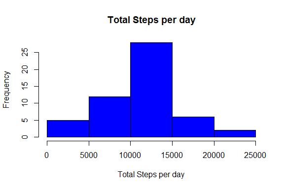
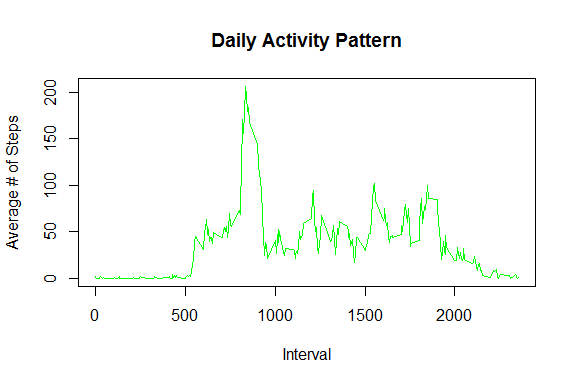
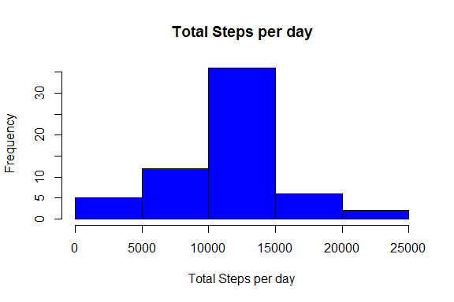
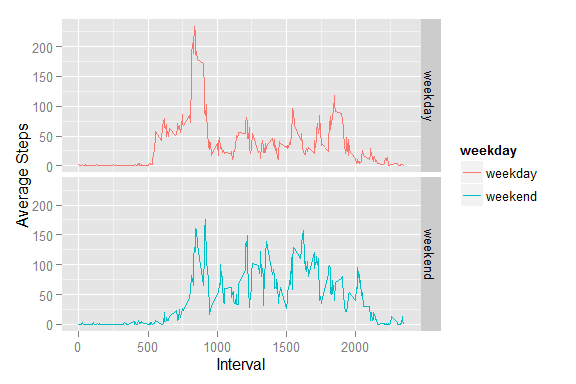

# Reproducible Research: Peer Assessment 1

Loading libraries used in the process:


```r
library(dplyr)
```

```
## 
## Attaching package: 'dplyr'
## 
## The following object is masked from 'package:stats':
## 
##     filter
## 
## The following objects are masked from 'package:base':
## 
##     intersect, setdiff, setequal, union
```

```r
library(ggplot2)
```

## Loading and preprocessing the data

First, loading the data.


```r
Data <- read.csv('Data//activity.csv')
```

## What is mean total number of steps taken per day?
Summarise data by date, calculating total steps per day


```r
Data_Summary <- summarise( group_by(Data, date), total_steps = sum(steps))
```

Produce histogram of total steps per day.


```r
hist(Data_Summary$total_steps, xlab="Total Steps per day", col="blue", main="Total Steps per day")
```

 

Calculate mean total steps per day:

```r
mean(Data_Summary$total_steps, na.rm=TRUE)
```

```
## [1] 10766.19
```

Calculate median total steps per day:

```r
median(Data_Summary$total_steps, na.rm=TRUE)
```

```
## [1] 10765
```
## What is the average daily activity pattern?
Summarise data by interval, calculating average steps per interval.
NA values are ignored

```r
Data_Summary2 <- summarise( group_by(Data, interval), average_steps = mean(steps, na.rm=TRUE))
```

Plot daily activity pattern:

```r
plot( Data_Summary2$interval, Data_Summary2$average_steps,type = "l", xlab = "Interval", ylab = "Average # of Steps", main= "Daily Activity Pattern", col = "green")
```

 

Identify 5-min interval with most steps taken:

```r
most_steps <- max(Data_Summary2$average_steps)
Data_Summary2[[match(most_steps,Data_Summary2$average_steps),1]]
```

```
## [1] 835
```
## Inputing missing values

Obtain count of missing values:

```r
sum(!complete.cases(Data))
```

```
## [1] 2304
```

For missing data, the average number steps for the interval will be used in generating a new data set with no NA.


```r
Data2 <- Data
for (irow in 1:dim(Data2)[1]){
  if (is.na(Data2[irow,"steps"])){
   Data2[irow,"steps"] <-  Data_Summary2[[match(Data2[irow,"interval"],Data_Summary2$interval),2]]
  }
}
```

# Repeating the mean total number of steps per day section, with the new data
Summarise new data by date, calculating total steps per day


```r
Data2_Summary <- summarise( group_by(Data2, date), total_steps = sum(steps))
```

Produce histogram of total steps per day.


```r
hist(Data2_Summary$total_steps, xlab="Total Steps per day", col="blue", main="Total Steps per day")
```

 

Calculate mean total steps per day:

```r
mean(Data2_Summary$total_steps, na.rm=TRUE)
```

```
## [1] 10766.19
```

Calculate median total steps per day:

```r
median(Data2_Summary$total_steps, na.rm=TRUE)
```

```
## [1] 10766.19
```

Due to the method used to replace the NA values, the mean for the total steps per day remains constant, but the median changes.

## Are there differences in activity patterns between weekdays and weekends?

Determine if day falls on weekday or weekend.


```r
Data$weekday <- weekdays(strptime(as.character(Data$date), "%Y-%m-%d") )
Data <- mutate(Data, weekday = ifelse(weekday %in% c("Saturday", "Sunday"), "weekend","weekday")) %>%
  mutate(weekday = as.factor(weekday))
```

Summarise data by interval and weekday/weekend.

```r
Weekend_Summary <- summarise( group_by(Data, interval, weekday), average_steps = mean(steps, na.rm = TRUE))
```

Plot daily activity graph, separating weekdays and weekends.

```r
plot1 <- qplot(interval, average_steps, data = Weekend_Summary, geom="path", color = weekday, facets = weekday ~ .)
plot1 + labs( x = "Interval", y = "Average Steps")
```

 
